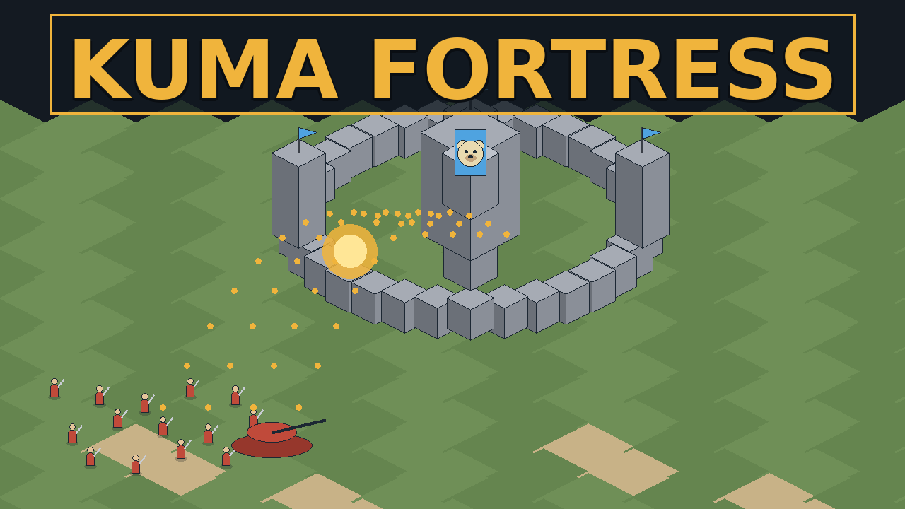
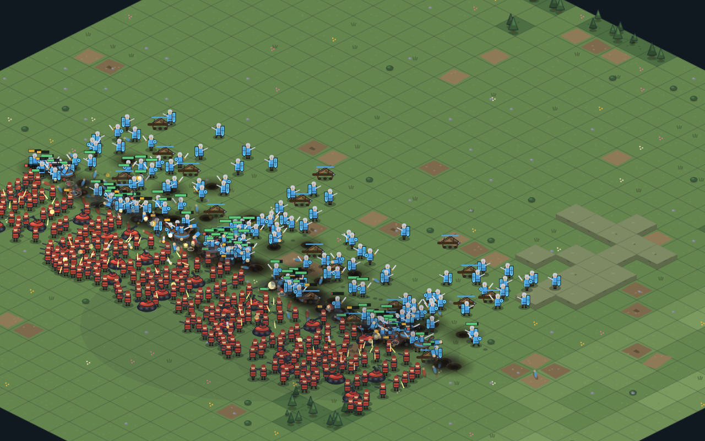
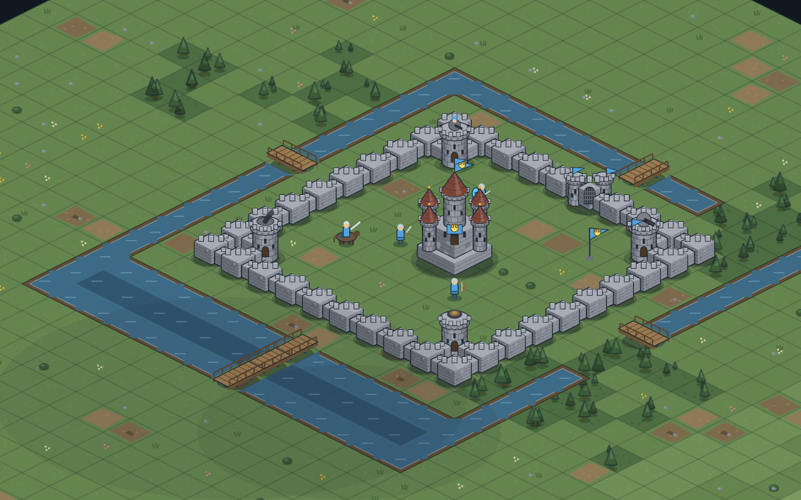

# 🐻 KUMA FORTRESS — 쿠마의 요새 전쟁

**짓고, 지키고, 무너뜨려라.** 브라우저에서 바로 실행되는 쿼터뷰 전쟁 시뮬레이션 게임.

▶ **플레이**: https://kuma-go.github.io/kuma-fortress/

## 모드

- 🏰 **요새 건설** — 성벽·성문·해자·다리·방어탑·함정·주둔 병력으로 나만의 요새 설계 (∞ 샌드박스 지원)
- 🛡 **방어 시뮬레이션** — 시대·강도를 골라 내 방어선이 버티는지 실험
- ⚔️ **요새 공략** — 프리셋 요새와 친구의 요새를 내 군대로 공략 (별점 평가)
- ⚗️ **전투 실험실** — TABS 스타일 양측 자유 배치 관전 모드. 부대 스탬프 ×25, 공성 실험 지원
- 🔗 **요새 코드** — 내 요새를 코드로 공유하고, 친구의 공략 결과 리포트를 확인

## 특징

세 시대(중세/화약/현대) 교차 전투 · 예측 사격과 산탄·도탄 탄도학 · 크레이터/화재/불타는 숲 등 전장 환경 파괴 · 랙돌 물리 · 경보·증원 수비 AI · 600+ 유닛 대군전 · 지형 6종 + 랜덤 시드

## 저작권

**© 2026 KUMA. All Rights Reserved.**
이 게임은 오픈소스가 아닙니다. 공식 배포처(위 플레이 링크)에서의 플레이만 허용되며,
코드·그래픽의 복제, 수정, 재배포, 타 사이트 재호스팅을 금지합니다. 자세한 내용은 [LICENSE.md](LICENSE.md) 참고.

---
Made with ❤️ by [KUMA](https://github.com/kuma-go) — procedurally rendered, zero dependencies, single file.
